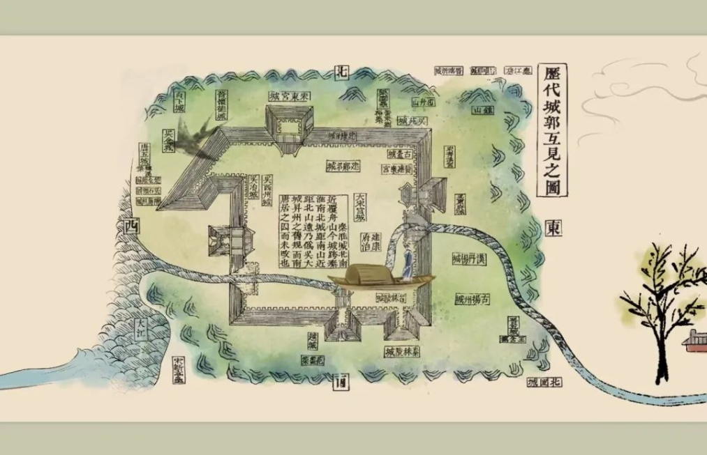
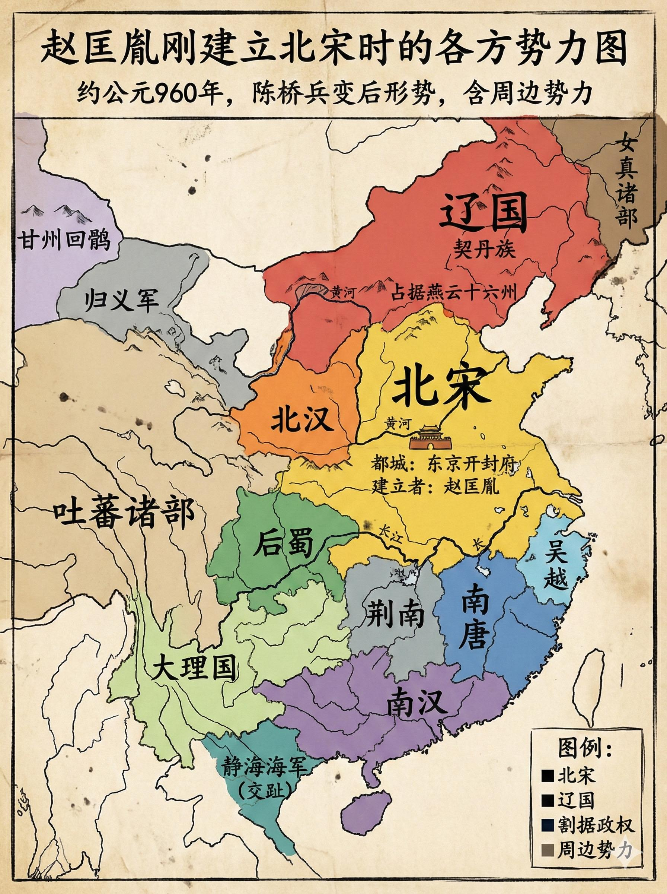

# 李煜：把江山写成词的人，终究输给了刀

城门打开的那一刻，金陵不只是丢了一座城。
**一个人一生的身份，开始塌陷。**

他是李煜，南唐最后的君王。
在词里，他是“天上人间”的主角；在史书里，他是“亡国之君”。
**这不是一个才子落难的故事，而是一个“角色错位”的悲剧。**

图源：Wikimedia Commons（File: Li_Yu_scth.jpg）

很多人同情李煜，是因为他“太像我们”。
喜欢美、厌恶杀伐、相信柔软能化解冲突。
**可历史从来不按“好人逻辑”运行。**

他继位时，南唐已是夹缝里的国家。
北方的宋朝一统大势已成，兵强粮足，制度也更紧密。
南唐的路，只剩两条：低头换生存，或硬撑拼尊严。
**李煜选择了前者，却仍未换来后者。**

有人说他“无能”。
但更深的事实是：他握着的是一个正在收缩的时代。
**当大势成形，个人的才情很难逆转结构性的失败。**

图源：出自宋《景定建康志》  

他不是没努力。
他试着安抚北宋、节省军费、稳住百姓。
**可每一次退让，都会换来更多要价。**

你可以把它想成现实中的博弈：
当对方掌握主动权，你的“克制”和“理性”不一定被理解为美德，
更可能被解读成“软弱”。

最终，宋军南下。
金陵失守，他被带到汴京。
**那个写“春花秋月何时了”的人，终于知道“何时了”。**

图源：Wikimedia Commons（File: Song Taizu.jpg）

在汴京，他过着一种奇特的生活。
表面有俸禄，实则处处受限。
他写的词，越来越冷。
**那不是“文艺”，是败者的自白。**

有人问：如果他更强硬，南唐会不会不亡？
答案并不乐观。
**一个国家的存亡，很少只由一个人决定。**

李煜的失败，不是因为他写词。
而是因为他在需要铁与火的岗位上，拿起了琴与墨。
**这种错位，让他成为历史上最“被记住的失败者”。**

他死在汴京。
有人说是赐死，也有人说是政治需要。
**无论真相如何，他的命运结局都早已写在大势里。**

图源：Wikimedia Commons（File: Li Jing of Southern Tang.jpg）

但李煜仍然重要。
因为他让我们看到：
**失败的人也有尊严，败局里也有真实的情感。**

历史常把胜者写成英雄。
李煜却提醒我们：
有些人没赢，但他把“失败的痛”写成了永恒。

如果你站在李煜的位置，你会选择低头求存，还是硬撑到底？
你觉得“才情”在权力与战争面前，还有意义吗？
欢迎留言。

